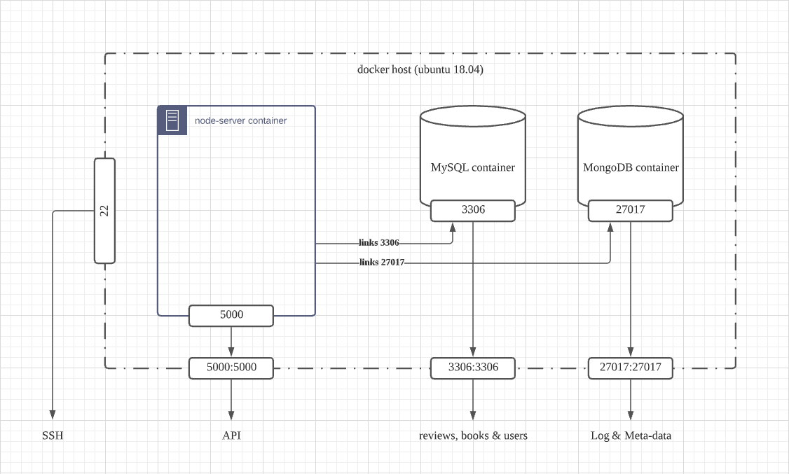
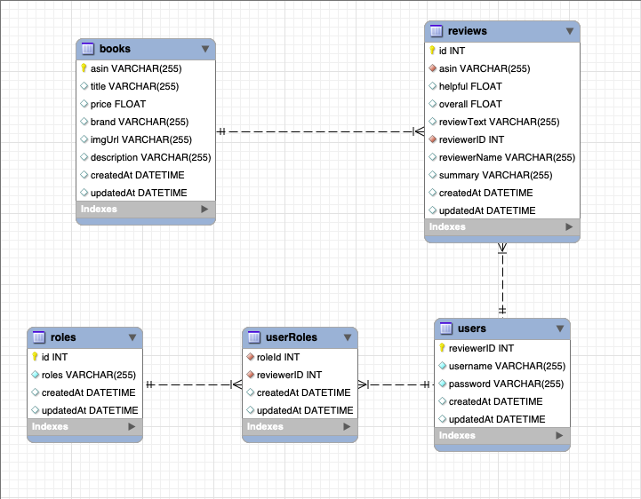

# Book Review Server Docker Cluster

<!-- logo -->
<p align="center">
    
</p>

<!-- table of contents -->

-   [Description](#Description)
    -   [Built With](#Built-With)
-   [Installation](#Installation)
    -   [Install locally as a docker cluster](#Install-locally-as-a-docker-cluster)
    -   [Deploy on a aws instance using terraform](#Deploy-on-a-aws-instance-using-terraform)
        -   [Sample credentials](#Sample-credentials)
        -   [deploy](#Deploy)
-   [Usage](#usage)
-   [Structure](#Structure)
    -   [Server](#Server)
    -   [MySQL Schema](#MySQL-Schema)

## Description

This is a Book Review service docker cluster that can be deploy to AWS using
TerraForm. Each container has their own `README` to explain its functionality.

### Built With

| Part            |      Technology      |
| --------------- | :------------------: |
| Server          | ExpressJS, Sequelize |
| Authentication  |     JsonWebToken     |
| Log             |       Winston        |
| Server Database |        MySQL         |
| Logger Database |       MongoDB        |
| Build           |    docker-compose    |
| Deployment      |      TerraForm       |

> Build time: AWS t2.micro takes 4 mins to build

## Installation

### Install locally as a docker cluster

```shell
docker-compose up
```

### Deploy on a aws instance using terraform

> :exclamation: :exclamation: :exclamation: If deploying on AWS, you only need
> to download or copy-paste file `BookReview.tf`. Link to the file
> [here](https://github.com/AnAsianGangster/BookReview/blob/master/BookReview.tf).

Before running TerraForm commands, you need to set up your AWS credentials.

```shell
mkdir .aws && cd .aws/ && touch credentials
```

#### Sample `credentials`

```
[test]
aws_access_key_id = <your aws access key id>
aws_secret_access_key = <your aws secret access key>
```

> You can change you instance type in `BookReview.tf` > **resource "aws_instance" "web-server-instance"**
> instance type attribute to your desire. For example,
> **instance_type = "t2.micro"**

#### Deploy

```shell
terraform init
terraform apply
```

## Usage

Root

```
http://<your instance ip>:5000
```

API route

```
http://<your instance ip>:5000/api
```

> Note: There are some sample API calls in `/node-server/resquests.rest`

| Request |         Location          |                             Description |
| ------- | :-----------------------: | --------------------------------------: |
| `POST`  |         /reviews          |                              new review |
| `GET`   |         /reviews          |                         get all reviews |
| `GET`   |       /reviews/`id`       |                      get review with id |
| `PUT`   |       /reviews/`id`       |                   update review with id |
| `POST`  |          /books           |                                new book |
| `GET`   |          /books/          |              get all books with reviews |
| `GET`   |       /books/`asin`       |                        get book with id |
| `PUT`   |       /books/`asin`       |                     update book with id |
| `POST`  |       /auth/signup        |                                new user |
| `POST`  |       /auth/signin        |                       authenticate user |
| `GET`   |   /all/`numberOfBooks`    | public content(default: 5 random books) |
| `GET`   |           /user           |                            user content |
| `GET`   | /userProfile/`reviewerID` |                   user with all reviews |
| `GET`   |           /mod            |                       moderator content |
| `GET`   |          /admin           |                           admin content |

> **WARNING** :exclamation: Need at least five dummy books in database

## Structure

### Server

The whole thing is a docker cluster


### MySQL Schema


